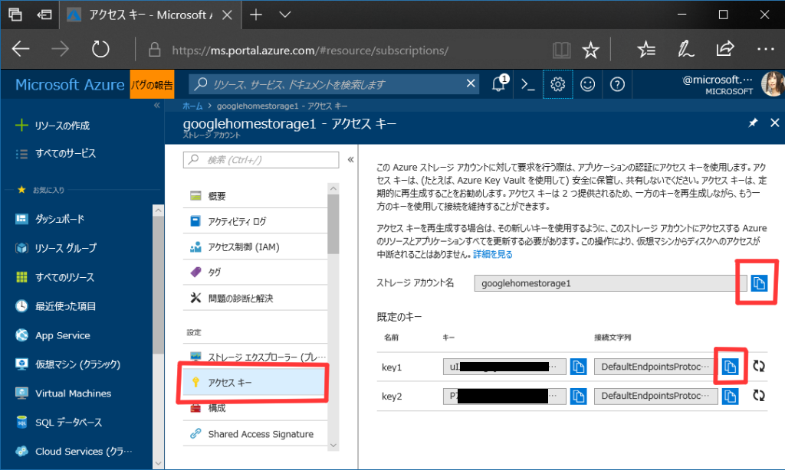

# Microsoft のサーバーレスのサービス Azure Functions (C#) を使って Google Home 対応アプリ「筋肉ボイス」

ちょまどさん ([@chomado](https://twitter.com/chomado)) のような筋肉を感じる声に変えてもらいましょう！       

Google Assistant 系のアプリは Node.js でやってる人が多いのですが、これは C# で書いてます。（私は C# 好き過ぎて Microsoft 入社しました。）     
(最初は node.js で書いていたのですが、途中で全部消して C# で書き直しました)

## 動作デモ動画

公開3日で 3.4万再生されました！

[https://twitter.com/chomado/status/974534165419892736]

↑ ぜひ音アリで見てください！

## 動作シナリオ

````
ユーザ「OKグーグル、筋肉ボイス」

「はい、筋肉ボイスに繋ぎます」

ユーザ「私の名前はちょまどです」

(イカツイ声で)「私の名前はちょまどです」
````

# 構成図（アーキテクチャ）

Microsoft のクラウドサービスである「[Microsoft Azure](https://aka.ms/azureevajp)　(アジュール)」などを使ってるよ！

## 使っているもの：
1. `自然言語解析エンジン` の `Dialogflow` (一応挟んでるけど、今回は発した言葉のオウム返しなので、あんまり処理は書いてない。Webhook に飛ばす綱渡しのために入れてる)
1. [Microsoft Azure](https://aka.ms/azureevajp) の `サーバーレス` のサービスである [Azure Functions](https://azure.microsoft.com/ja-jp/services/functions/) (アジュール・ファンクション)。ここで自分の書いたプログラムが動くことになる
1. 文字列を渡したらそれを任意の声で読み上げてくれる `text to speech`のサービス「[VoiceText Web API](https://cloud.voicetext.jp/webapi)」
1. [Microsoft Azure](https://aka.ms/azureevajp) の `ファイル置き場` の [Azure Storage](https://azure.microsoft.com/ja-jp/services/storage/) (アジュール・ストレージ)

## 処理の流れ


1. ユーザー「ちょまどだよ！」    
1. → `Google Assistant`「"ちょまどだよ" って言ったわ」    
1. → `Dialogflow`「Webhook に飛ばすわ」    
1. → `Azure Functions` に書いた私のコード「"ちょまどだよ"って来たわ。音声変換APIに飛ばすわ」    
1. → `VoiceText Web API`「mp3 に変換して返すわ」    
1. → `Azure Functions` に書いた私のコード「mp3来たからクラウド上のストレージに保存しておいて、その保存先のURL貰うわ」    
1. → `Azure Storage`「保存したよ。アクセスするためのURLはこれだよ https://-----」    
1. → `Azure Functions` に書いた私のコード「Google Home (の上で動いてる Actions on Google)に mp3 渡して読み上げてもらうわ」     
1. → `Google Home`「（野太い声で）ちょまどだよ」    
1. → ユーザ「きゃっきゃっ」

## 動かすために自分でやること

ーー

追記：前村さんが記事を書いてくださいました！ありがとうございます！

[ちょまどさんの筋肉ボイスを動かしてみた](http://satoshi-maemoto.hatenablog.com/entry/2018/05/12/082525)

ーー
書いたコードは全て上げていますが、  

各種使用サービスの APIキーなど、秘密にするべきものはもちろん public に上げていません。

なので、clone 後、以下の手順を踏む必要があります。    
（この手順書はまだ途中です！あとで完成させます）

1. *声を変える* ために使うサービスのAPIキー入手
    - [VoiceText Web API](https://cloud.voicetext.jp/webapi) の APIキー取得。（最初の画面の「はじめる」から先に進んだら、登録したメアドにAPIキーが届きます）
2. (注) これから先、処理を動かす場所の確保 & mp3ファイル保存のために、クラウドサービスの [Microsoft Azure](https://aka.ms/azureevajp)(アジュール)を使います。まだアカウントをお持ちでない方は [こちら](https://aka.ms/azureevajp)からトライアル開始できます
2. VoiceText Web API が吐いた *mp3の保存場所* の接続文字列など入手
    - ラズパイとか用意したり自分でサーバ立てるのが面倒だったので、Microsoft のクラウドサービスを使います。ということで [Microsoft Azure の管理ポータル](http://portal.azure.com)を開きます。
	- 画面左上の「＋リソースの作成」から、ストレージアカウント (mp3保存場所)のインスタンス立ち上げる
    - ストレージアカウント (mp3保存場所)の APIキー２つ取得（少し分かりにくいと思ったので下にスクショ載せました）
3. 環境変数の書き換え
    - ストレージへのアクセスするための秘密の文字列（接続文字列）を、Azure Functions の環境変数一覧の中に登録する
    - この方法は後で書く！！

### Azure ポータル上での操作

↓ Microsoft Azure で作った「ストレージアカウント」を開くと、最初はこんな画面である。    
ちなみに、我々は、この「ストレージアカウント」の中の「`Blob (Binary Large OBject) Storage`」という機能だけ使うことになる。現段階では mp3 突っ込むだけなので。


↓ この左の「アクセスキー」をクリックして、以下２か所からコピーして メモ帳アプリかどこかに控えておく。


