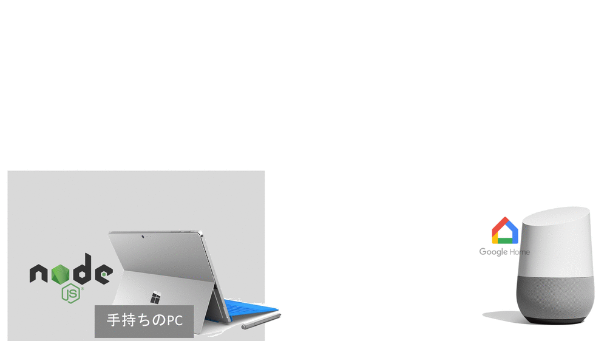
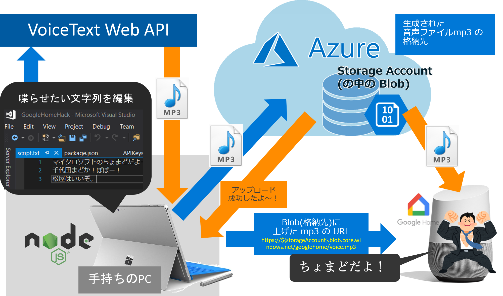

# Google Home Hack

Google Home に好きな声で喋らせるものです。     
(注意) このプロジェクトは clone してもそのまま動きません。APIキーを設定ファイルに書いたりする必要があります。詳しくは下にまとめて書いてあるので読んでください

## 動作デモ

必ず見てください！80秒間です

[https://twitter.com/chomado/status/953832898842341376]

## アーキテクチャ

`開発PC` → `VoiceText Web API`(声変換) → `Microsoft Azure Blob Storage`(mp3保存) → `Google Home`



## 動かすために自分でやること

書いたコードは全て上げていますが、   
各種使用サービスの APIキーなど、秘密にするべきものはもちろん public に上げていません。

なので、clone 後、以下の手順を踏む必要があります。    


1. *声を変える* ために使うサービスのAPIキー入手
    - [VoiceText Web API](https://cloud.voicetext.jp/webapi) の APIキー取得。（最初の画面の「はじめる」から先に進んだら、登録したメアドにAPIキーが届きます）
2. * これから先、mp3ファイル保存のために クラウドサービスの [Microsoft Azure](https://aka.ms/azureevajp)(アジュール)を使います。まだアカウントをお持ちでない方は [こちら](https://aka.ms/azureevajp)から登録をお願いします。
2. VoiceText Web API が吐いた *mp3の保存場所* の接続文字列など入手
    - ラズパイとか用意したり自分でサーバ立てるのが面倒だったので、Microsoft のクラウドサービスを使います。ということで [Microsoft Azure の管理ポータル](http://portal.azure.com)を開きます。
	- 画面左上の「＋リソースの作成」から、ストレージアカウント (mp3保存場所)のインスタンス立ち上げる
    - ストレージアカウント (mp3保存場所)の APIキー２つ取得（少し分かりにくいと思ったので下にスクショ載せました）
3. *設定ファイル* 書き換え
    - APIキーなどが書いてある秘密のファイル(つまり皆に見せちゃダメだよ)の `Keys/APIKeys_sample.json` のファイル名を `APIKeys_sample.json` から `APIKeys.json` に変更。
    - そしてそのファイルをエディタで開いて中身を書き換える。（上で取得したキー文字列を入れることになる）
4. `VoiceTextWriter.js` の `OUT_PATH` が、今は私の環境のもの（`/Users/chomado/...`）をべた書きしてるけど、これ自分のものに書き換えてください。

### Azure ポータル上での操作

↓ Microsoft Azure で作った「ストレージアカウント」を開くと、最初はこんな画面である。    
ちなみに、我々は、この「ストレージアカウント」の中の「`Blob (Binary Large OBject) Storage`」という機能だけ使うことになる。現段階では mp3 突っ込むだけなので。


↓ この左の「アクセスキー」をクリックして、以下２か所からコピーして `Keys/APIKeys.json` に貼り付ける。


## Background

Google Home への接続は `google-home-notifier` パッケージ様を使っています。

これは本当に便利なライブラリで、

例えば、普通に Google Home のお姉さんの声で読み上げて欲しいなら、
````js
googlehome.notify('こんにちは、ちょまどです！', function(res) {
  console.log(res);
});
````
これだけで動きます。

`開発PC` → `Google Home`

しかし、今回、私はたくましい男の人に喋ってほしかったので、[VoiceText Web API](https://cloud.voicetext.jp/webapi)を使用しました。

`開発PC` → `VoiceText Web API`(声変換) → `Microsoft Azure Blob Storage`(mp3保存) → `Google Home`

なので、少しだけ複雑になっていますが、大丈夫です。


↑ gif アニメ版    
↓ 静止画版



## Next Step

現在、発火が開発PCから直接 `node main.js` している状態なので、

次は、スマートスピーカーらしく、    
「Google Home に『声を変えて』と声をかけるなど『声で発火できるように』」させる必要があります
